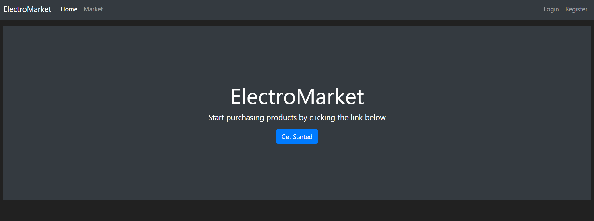
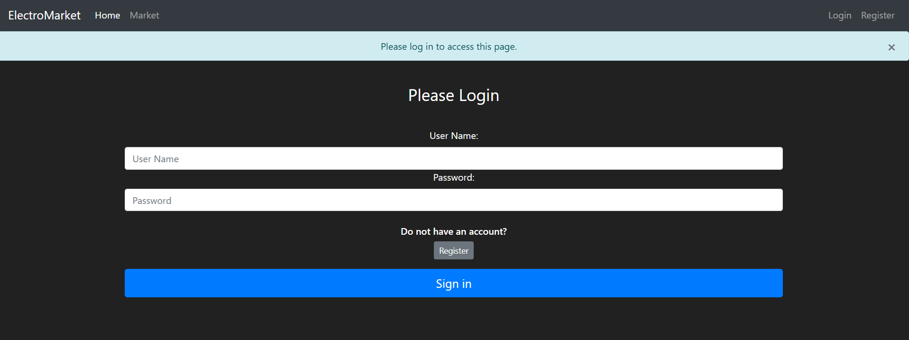
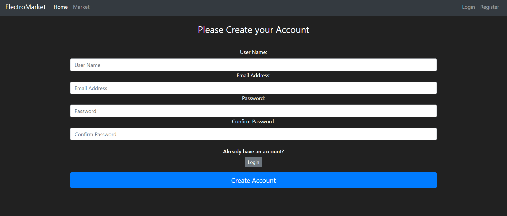
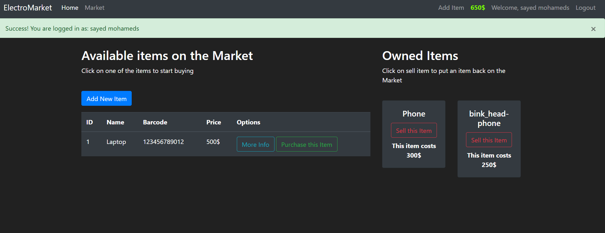
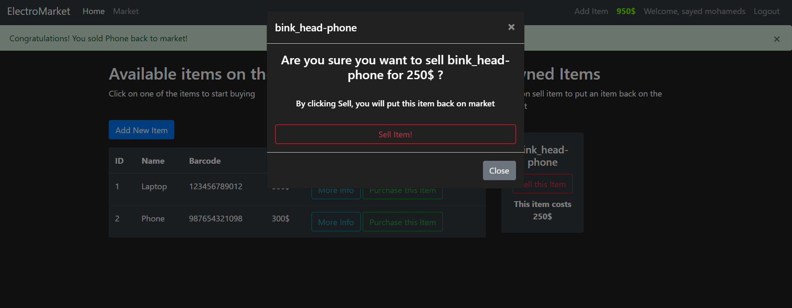

# This is our Readme file to explain the whole project the project is has a simple idea is to make the user of this website to put items in it and to can buy items from the market we only handle the interact of the user not the delivery or the admin benefit .. 

## The technologies we used: 
  #### Flask
  #### SQLite
  #### HTMl templates 
  #### jinjga templates 
  #### bootstrap : to handle a good working website with some function to inhance the UX 
##

### you can find all the requeriments you need in [requeriments](requeriments.txt) file..
##
## how to run it perfectly if you want to practise some real world app :

### run the fike that called create_db first then run.py all of that after you install python env and the flask and sqlite ..

# The project OverView 

### the main page 

### the login page 

### the login page 

### the User Page 

### add item to sell in the store 

### remove item from your cart 

